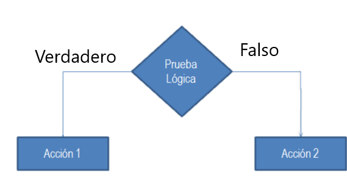

class: center, middle

.linea-superior[]
.linea-inferior[]


## INE Educa: Clases abiertas de R

## Proyecto Ciencia de Datos

## Herramientas de edición de datos II 


```{r setup, include=FALSE}
options(htmltools.dir.version = TRUE)
knitr::opts_chunk$set(message = FALSE, warning = F, eval = T) 
options(scipen = "999")
options(knitr.table.format = "html")

```

```{r xaringan-themer, include=FALSE, warning=FALSE}
library(xaringanthemer)
library(dplyr)
library(magrittr)
library(readr)

library(kableExtra)
```

---

name: diapo-basica
background-image: url("imagenes/fondo2.PNG")
background-size: contain;
background-position: 100% 0%

# Edición de datos II: lógica condicional
---

template: diapo-basica

Ahora sabemos cómo crear columnas y modificar columnas existentes.

Sin embargo, las funciones que vimos se aplican de igual manera a toda la columna.

--

A veces (***muchas*** veces), queremos aplicar **lógica condicional** a la creación o modificación de columnas.

¿Qué significa esto?

--

.center[
]


---

template: diapo-basica

## if_else


Esta función permite implementar la lógica anterior y tiene la siguiente sintaxis:

```{r, eval=F}
if_else(condicion_logica, valor_si_verdadero, valor_si_falso, valor_si_missing)
```
--

Esto podría leerse de la siguiente manera: evalúa la condición `condicion_logica` en cada fila, si esta
se cumple en la fila, tomará el valor asignado en `valor_si_verdadero`, si no, toma el valor asignado en
`valor_si_falso`. Por último, si la fila tenía un NA, nos permite especificar qué valor toma con `valor_si_missing`.

--
 Para aplicar esta función, volveremos a crear un dataset de prueba:


```{r, warning=FALSE, eval=T}

tabla_ejemplo <- data.frame(nombre = c('Claudio', 'Francisco', 'Francisca', 'Pedro'),
                    edad = c(33, 44, 22, 31),
                    estatura = c(171, 153, NA, 160))

```

```{r, warning=FALSE, eval=TRUE, echo = F}
tabla_ejemplo  %>% knitr::kable()

```
---

template: diapo-basica

## if_else

Marquemos en una nueva columna `mas_de_170` a las personas que miden más de 170cm y 
asignemos un valor especial `-66` para quienes tienen un valor nulo (`NA`).

```{r, warning=FALSE, eval=TRUE, echo = T}
tabla_ejemplo2 = tabla_ejemplo  %>% mutate(mas_de_170 = if_else(condition = estatura > 170,
                                                                true = 1, false = 0,
                                                                missing = -66))


```


```{r, warning=FALSE, eval=TRUE, echo = F}
tabla_ejemplo2  %>% knitr::kable()

```
---
template: diapo-basica

## if_else

Las expresiones `if_else` son bastante flexibles y aceptan expresiones como las de
`mutate`, siempre y cuando **hagan referencia al mismo tipo de datos en todos los casos**.
--

Un ejemplo

```{r, warning=FALSE, eval=TRUE, echo = T}
tabla_ejemplo3 = tabla_ejemplo  %>% mutate(col_prueba = if_else(condition = edad > 35,
                                                                true = edad * 2,
                                               false = (estatura - 100)))
```

--
```{r, warning=FALSE, eval=TRUE, echo = F}
tabla_ejemplo3  %>% knitr::kable()

```

---
template: diapo-basica

## if_else

Las expresiones `if_else` son bastante flexibles y aceptan expresiones como las de
`mutate`, siempre y cuando **hagan referencia al mismo tipo de datos en todos los casos (true, false, missing)**.

--

Otro ejemplo:

```{r, warning=FALSE, eval=TRUE, echo = T}
tabla_ejemplo4 = tabla_ejemplo  %>%
  mutate(empieza_con_F = if_else(condition = nombre %>% stringr::str_starts('F'),
                                 true = 'Sí',
                                 false = 'No'))
```

--
```{r, warning=FALSE, eval=TRUE, echo = F}
tabla_ejemplo4  %>% knitr::kable()

```
---
template: diapo-basica

## case_when

Cuando queremos generar una variable en base a más de una condición, la mejor alternativa
es el uso de la función `case_when`. Esta función tiene una sintaxis ligeramente distinta:
--

```{r, eval=F}
case_when(condicion_logica1 ~ valor_si_condicion1,
        condicion_logica2 ~ valor_si_condicion2,
        condicion_logica3 ~ valor_si_condicion3,
        etc)
```

Puntos importantes a tener presente:

--

Si no se cumple una condición, el valor asignado será `NA`.

--

Las condiciones se evalúan en orden. Una vez se cumple una para una fila, se le asigna el valor
correspondiente y el resto de condiciones dejan de evaluarse.

---
template: diapo-basica

## case_when

Veamos ejemplos que ilustren la función y los puntos anteriores.

--

Creamos un dataframe de ejemplo:

```{r, eval=T, echo=T}
regiones = data.frame(region = c(1:3, -99, NA),
                      ingreso_promedio = c(8.5e5, 9e5, 9.5e5, 1e6, 1.5e6),
                      ingreso_mediano = c(4.5e5, 6.5e5, 7e5, 8e5, 8.1e5)) %>% 
  # Agregamos identificador de fila como primera columna:
  mutate(id_fila = row_number(), .before = region)
```

--
```{r, warning=FALSE, eval=TRUE, echo = F}
regiones  %>% knitr::kable() 

```
---
template: diapo-basica

## case_when

Recodifiquemos las regiones:

--

```{r, eval=T, echo=T}
regiones_cod = regiones %>% mutate(region_cod = case_when(region == 1 ~ 'Arica y Parinacota',
                                                          region == 2 ~ 'Antofagasta',
                                                          region == 3 ~ 'Atacama')) 
```

--
```{r, warning=FALSE, eval=TRUE, echo = F}
regiones_cod %>% knitr::kable()  
```
---
template: diapo-basica

## case_when

Recodifiquemos las regiones:


```{r, eval=T, echo=T}
regiones_cod = regiones %>% mutate(region_cod = case_when(region == 1 ~ 'Arica y Parinacota',
                                                          region == 2 ~ 'Antofagasta',
                                                          region == 3 ~ 'Atacama')) 
```


```{r, warning=FALSE, eval=TRUE, echo = F}
regiones_cod %>%  mutate(
  region_cod = cell_spec(region_cod, color = ifelse(is.na(region_cod), "white", "black"),
                  background = ifelse(is.na(region_cod), "red", "white"),
                  bold = ifelse(is.na(region_cod), T, F)))   %>%
  knitr::kable(escape = F, booktabs = T) %>%
  kable_styling() 
```
¿Qué podemos hacer para evitar que queden NA en la nueva columna?

---
template: diapo-basica

## case_when

Recodifiquemos las regiones:


```{r, eval=T, echo=T}
regiones_cod = regiones %>% mutate(region_cod = case_when(region == 1 ~ 'Arica y Parinacota',
                                                          region == 2 ~ 'Antofagasta',
                                                          region == 3 ~ 'Atacama',
                                                          TRUE ~ 'Otra')) #<< 
```
--

```{r, warning=FALSE, eval=TRUE, echo = F}
regiones_cod %>%  mutate(
  region_cod = cell_spec(region_cod, color = ifelse(region_cod == 'Otra', "white", "black"),
                  background = ifelse(region_cod == 'Otra', "red", "white"),
                  bold = ifelse(region_cod == 'Otra', T, F)))   %>%
  knitr::kable(escape = F, booktabs = T) %>%
  kable_styling() 
```
Al añadir la condición `TRUE` al final (que siempre será evaluada como verdadera), agregamos
un valor para cuando ninguna de las otras condiciones se haya cumplido.

---
template: diapo-basica

## case_when

Veamos un caso en que se cumpla más de una condición. Creemos categorías en base a condiciones arbitrarias:


```{r, eval=T, echo=T}
regiones_cat = regiones %>% mutate(categoria = case_when(ingreso_promedio > 1000000 ~ '1',
                                                          ingreso_mediano >= 800000 ~ '2',
                                                          ingreso_mediano < 680000 ~ '3',
                                                          TRUE ~ 'Otra'))
```
--

```{r, warning=FALSE, eval=TRUE, echo = F}
regiones_cat %>%  
  knitr::kable() 
```

---
template: diapo-basica

## case_when

Ahora invirtamos la primera y la segunda condición:


```{r, eval=T, echo=T}

regiones_cat2 = regiones %>% mutate(categoria = case_when(ingreso_mediano >= 800000 ~ '2', #<<
                                                          ingreso_promedio > 1000000 ~ '1', #<<
                                                          ingreso_mediano < 680000 ~ '3',
                                                          TRUE ~ 'Otra')) 
```


```{r, warning=FALSE, eval=TRUE, echo = F}
regiones_cat2 %>%  mutate(
  categoria = cell_spec(categoria, color = ifelse(id_fila == 5, "white", "black"),
                  background = ifelse(id_fila == 5, "red", "white"),
                  bold = ifelse(id_fila == 5, T, F)))   %>%
  knitr::kable(escape = F, booktabs = T) %>%
  kable_styling() 
```

--

Es **sumamente importante** ser cuidadoso/a con el orden de las condiciones cuando puede cumplirse más de una,
pues, como vimos, puede tener efectos imprevistos en las columnas creadas.

---

class: center, middle

.linea-superior[]
.linea-inferior[]


## INE Educa: Clases abiertas de R

## Proyecto Ciencia de Datos

## Herramientas de edición de datos II 

